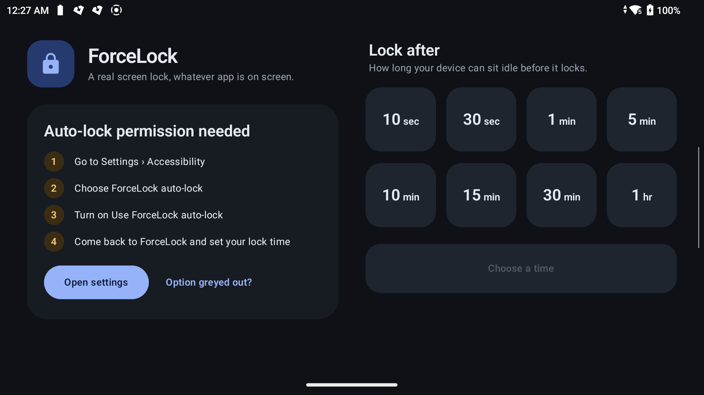
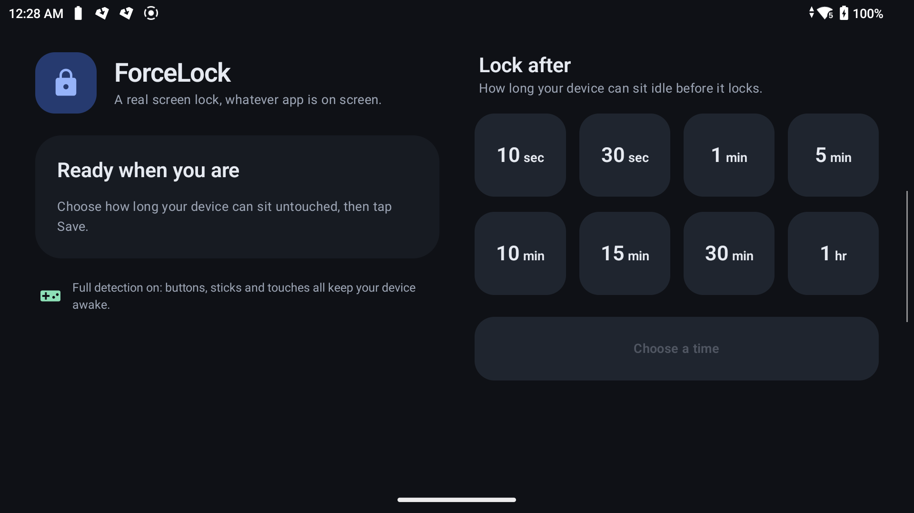

# ForceLock

**A real screen lock, whatever app is on screen.**

Some launchers and games keep your screen awake forever, so your device never locks and the
battery quietly drains. ForceLock fixes that. Pick how long your device can sit idle, and it locks
itself, just like pressing the power button.

Made for handhelds like the **AYN Odin 2 Portal** running **ES-DE**, and works on any device with
Android 9 or later.

<p align="center">
  
  
</p>

## Why you'll like it

- **Set it once.** Choose 10 sec, 30 sec, 1, 5, 10, 15, 30 min or 1 hr, tap Save, done.
- **A real lock.** Your screen turns off and your usual PIN, pattern or fingerprint lock comes up.
- **Nothing keeps it awake.** It doesn't matter which app, game or launcher is open.
- **Made for handhelds.** A dark, landscape-friendly design you can use entirely with a controller.
- **Private by design.** No internet, no tracking, and it never reads what's on your screen.

## How it works

ForceLock quietly watches for one thing: whether you're still using your device. Every button
press, touch or stick movement resets its timer. Once you've been away for the time you chose,
it locks the screen the same way the power button does.

The timer pauses while the screen is off and starts fresh when you unlock, so it never gets in
your way while you're playing.

## Get started

1. Install ForceLock on your device.
2. Open it and tap **Open settings**.
3. Choose **ForceLock auto-lock** and turn on **Use ForceLock auto-lock**.
4. Come back, pick a lock time and tap **Save**.

That's it. Your device now locks itself when you put it down.

### Want touches and analog sticks to count too?

Out of the box, ForceLock sees every button press. Games played only by touch or analog stick
need one extra step from a computer:

```bash
adb shell pm grant com.mariotatis.forcelock android.permission.DUMP
```

---

ForceLock is a personal project, built to be installed directly rather than through the Play
Store. To build it yourself, run `./gradlew :app:installDebug` with your device connected.
